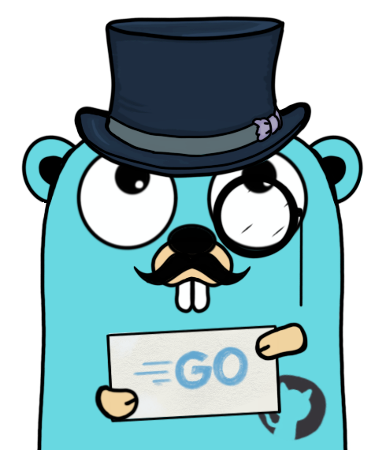

# GopherLight 

     




### What is GopherLight?
Hey there! So, you know how building web applications can sometimes feel like climbing a mountain? Well, GopherLight is like that cool hiking buddy who helps you navigate the trail, making things way easier and way more fun!

GopherLight is a micro framework for Go (Golang) that brings a bit of the simplicity and flexibility of the popular Express.js framework from the Node.js world right to your Go projects. It’s perfect for those times when you want to whip up a web server or an API without getting bogged down in all the nitty-gritty details.

Imagine you want to handle HTTP requests and create endpoints to manage users—just like in a classic CRUD (Create, Read, Update, Delete) app. GopherLight, you can define your routes and handlers in a snap. No need to wrestle with the standard net/http package; instead, you get a clean and straightforward way to manage your routes and responses.

The cool part? You get to focus on writing your application logic while the framework handles the heavy lifting under the hood. Need to add a new route? Just call a method and pass in your handler. Want to send a JSON response? Easy peasy!

Plus, it’s lightweight, so it won’t weigh down your application. You get all the goodies of a modern web framework while keeping things simple and fast. Whether you're a seasoned pro or just dipping your toes into web development, express-go makes it a breeze to get your ideas off the ground.

So, if you’re looking for a friendly and efficient way to build web apps in Go, GopherLight is your new best friend. Grab your backpack, and let’s hit the trail!

> [!WARNING]
> We are in an initial beta version, so it is likely that the framework will change a lot, always stay up to date, with an updated version of your code using the framework.

### Tasks

- [x] router
- [x] http requests
- [x] manipulation of the methods (get, post, pu, delete ...)
- [ ] middleware (authentication, timeout, anti csrf, etc...)
- [ ] next func
- [ ] more detailed error logs
- [ ] More complete documentation

### Installation

```bash
go get github.com/BrunoCiccarino/GopherLight/router
go get github.com/BrunoCiccarino/GopherLight/req
```

### basic usage example

```go
func main() {
	app := router.NewApp()

	// Define a route that responds to a GET request at "/hello".
	app.Route("GET", "/hello", func(r *req.Request, w *req.Response) {
		w.Send("Hello, World!")
	})

	fmt.Println("Server listening on port 3333")
	app.Listen(":3333")
}
```

# Contribute

That said, there's a bunch of ways you can contribute to this project, like by:

* ⭐ Giving a star on this repository (this is very important and costs nothing)
* 🪲 Reporting a bug
* 📄 Improving this [documentation](./docs/)
* 🚨 Sharing this project and recommending it to your friends
* 💻 Submitting a pull request to the official repository
* ⚠️ Before making a pull request, it is important that you read our [doc](./docs/CONTRIBUTE.md)


## Contributors

This project exists thanks to all the people who contribute. 

<a href="https://github.com/BrunoCiccarino/GopherLight/graphs/contributors">
  
</a>

